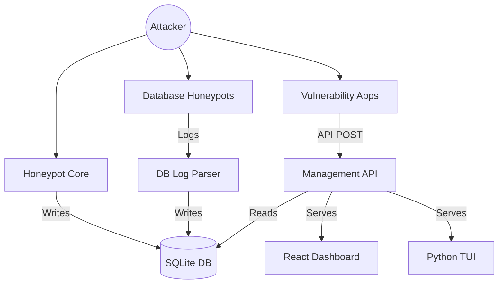

# 🏗️ System Architecture & Integration

This document provides a deep dive into the internal mechanics of the Honeypot System.

---

## 🗺️ High-Level Overview

The system is designed as a **Decentralized Layered Honeypot**. Unlike a monolithic application, it is a collection of independent services that coordinate through shared state and a centralized management API.

---

## 📂 Component Breakdown

### 1. Honeypot Core (`honeypot/`)
The primary entry point for common protocols (SSH, HTTP, FTP, etc.).
*   **Asynchronous TCP listeners**: Written in Python using `asyncio` for high performance.
*   **Protocol Handlers**: Modular classes in `honeypot/protocols/` that implement specific deception logic.
*   **Direct Logging**: Writes connection metadata and credential captures directly to the shared SQLite database.

### 2. Vulnerability Decoys (`vulnerabilities/`)
Highly interactive, containerized applications designed to be "broken."
*   **Isolation**: Each app runs in its own Docker container.
*   **Reporting**: Apps are "instrumented" with monitoring logic that captures RCE/SQLi payloads and POSTs them to the Management API's ingestion endpoint.
*   **Polyglot**: Includes decoys written in Node.js (Express) and PHP.

### 3. Management API (`api/`)
The central "Brain" of the operation.
*   **FastAPI Backend**: Provides REST and WebSocket endpoints for real-time monitoring.
*   **Internal Ingest**: A secure endpoint (`/api/internal/ingest/event`) for decentralized vulnerability containers to report activity.
*   **DB Parser**: A background observer that "tails" native logs from the real database honeypots (MySQL, Redis, etc.) and transforms them into a unified format.

### 4. Sandbox Layer (`honeypot/sandbox.py`)
Uses **nsjail** to wrap protocol handlers.
*   **Process Isolation**: Each connection gets its own unprivileged process space.
*   **Filesystem Chroot**: Handlers see a fake root filesystem, preventing any potential escape into the host system.

---

## 🔗 Data Flow & Integration

### The Lifecycle of an Event:
1.  **Trigger**: An attacker sends a POST request to `/api/ping?host=;cat /etc/passwd` on the Node RCE container.
2.  **Capture**: The Node.js app's instrumentation logic captures the IP and the raw payload.
3.  **Transmission**: The app sends the payload via a secure POST request to the `mgmt` API.
4.  **Persistence**: The Management API validates the `X-API-Key` and writes the event to the SQLite database.
5.  **Notification**: The API pushes the new event to all active WebSocket clients (Web UI and TUI).
6.  **Presentation**: The dashboard updates in real-time, highlighting the "Command Injection" attempt.
